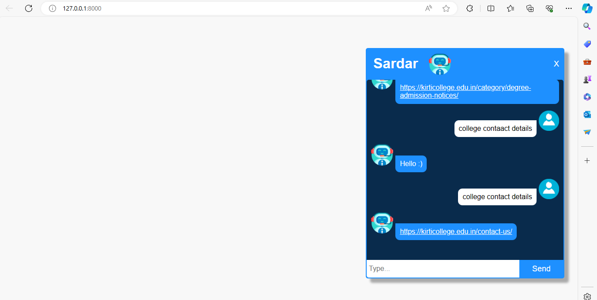
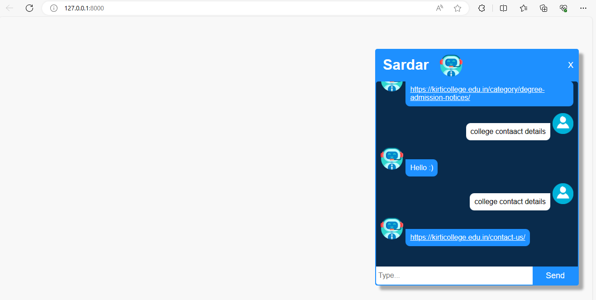

Project Name

[Chatbot_Django]

Description

A Django-based chatbot application designed to provide information about Kirti College to prospective students and others seeking details about the college.

Features

Handles various greetings and inquiries.
Provides information on admission processes for degree, PG, and junior levels (links to relevant webpages).
Offers contact details for the college.
Answers questions about extracurricular activities (suggests contacting the college).
Directs users to the exam details website (links to Deccan Society website).
Guides users to contact the College Placement Cell for placement-related information.
Installation

Prerequisites: Ensure you have Python (version 3.x recommended) and pip (the package installer) installed. You can download them from https://www.python.org/downloads/.
Clone the Repository:
Bash
git clone https://github.com/aideveloper123/Powerful-Django-Chatbot.gitt
Use code with caution.
Replace https://github.com/aideveloper123/Powerful-Django-Chatbot.git with the actual URL of your project's Git repository.
Create a Virtual Environment (Recommended):
Bash
python -m venv venv  # Replace 'venv' with your desired virtual environment name
source venv/bin/activate  # Activate the virtual environment (Linux/macOS)
venv\Scripts\activate.bat  # Activate the virtual environment (Windows)
Use code with caution.
Install Dependencies:
Bash
pip install -r requirements.txt
Use code with caution.
Usage

Run Migrations:
Bash
python manage.py migrate
Use code with caution.
Start the Development Server:
Bash
python manage.py runserver
Use code with caution.
This will typically start the server at http://127.0.0.1:8000/. The exact port may vary.

source files
<video controls src="Aapi-AI ChatBot and 3 more pages - Profile 1 - Microsoft​ Edge 2024-03-10 19-00-44.mp4" title="Title"></video>

imaage files 
second image 